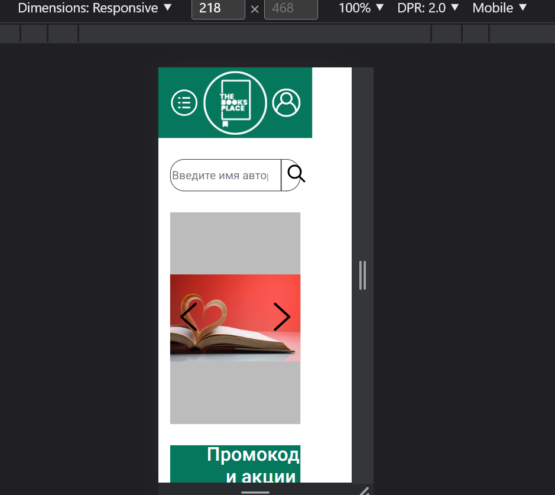

1. В index.html у ссылок у тебя относительный путь, лучше использовать абсолютный, так ты не будешь привязан к
   расположению текущего файла
2. Не очень понятно почему использовался чистый css вместо scss, ну тут выбор за тобой, конечно
   scss дает огромное количество фич, среди которых возможность разбить стили на несколько файлов, а не всё в одном
   месте хранить, как у тебя
3. при ширине экрана меньше 280px вёрстка ведет себя неправильно. Надо задать minwidth 
   Можешь посмотреть на том же mdn как верстка себя ведёт https://developer.mozilla.org/ru/
4. books содержит в себе картинки, поэтому стоит её перенести в директорию images
5. Цвета лучше писать в единном формате, и желательно не использовать ключевые слова типа white и тп. Я бы советовал юзать HEX, но этот вопрос довольно холиварный, поэтому оставляю выбор тебе, главное чтобы в одном формате всё
